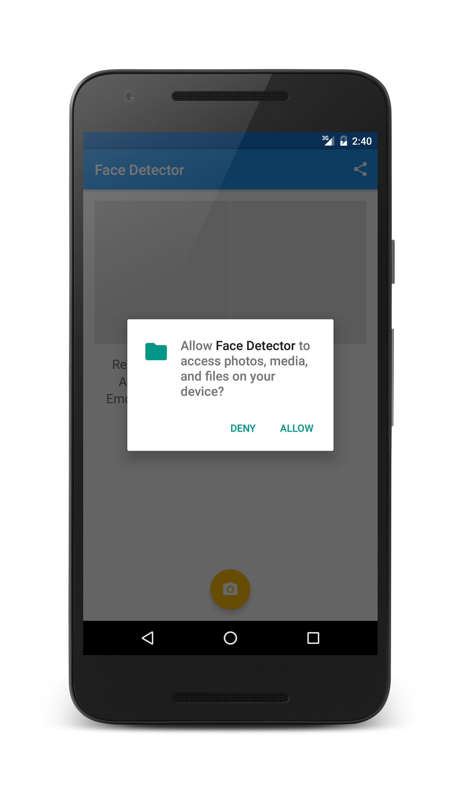

# FaceDetector
A Simple Android Application using Microsoft Project Oxford API

To run the application got to [Project Oxford](https://www.projectoxford.ai/) and create an account, then get the face detection subscription key and add it to local.properties file as follows

```
face.detection.key = YOUR_KEY_HERE
```


<a href="url"></a>

